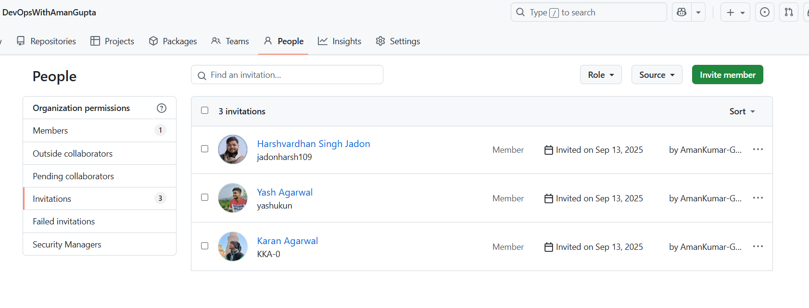
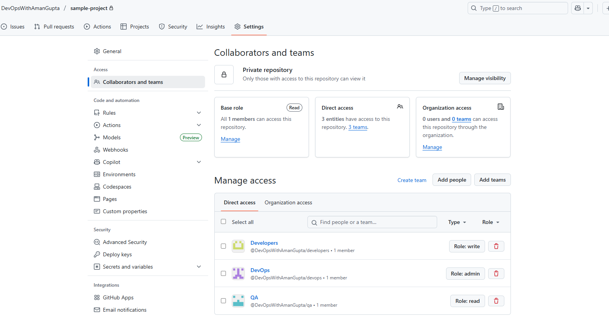
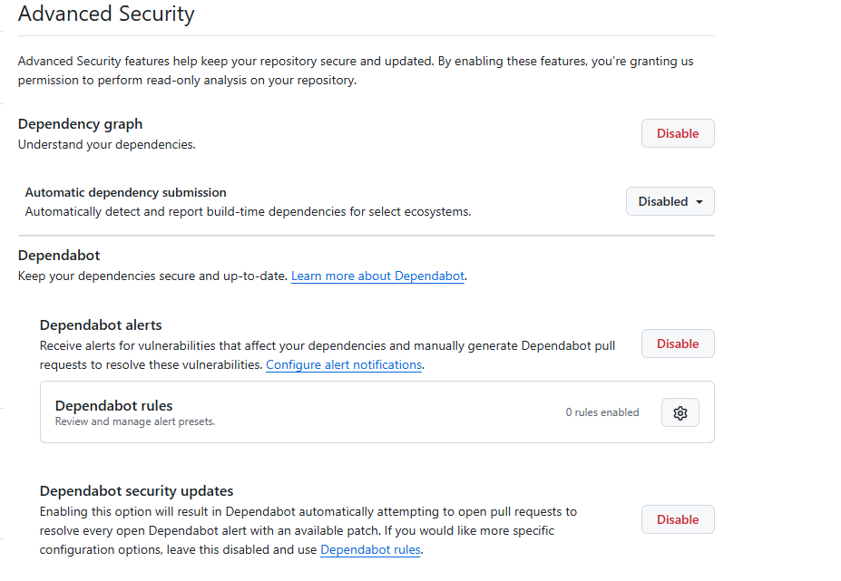
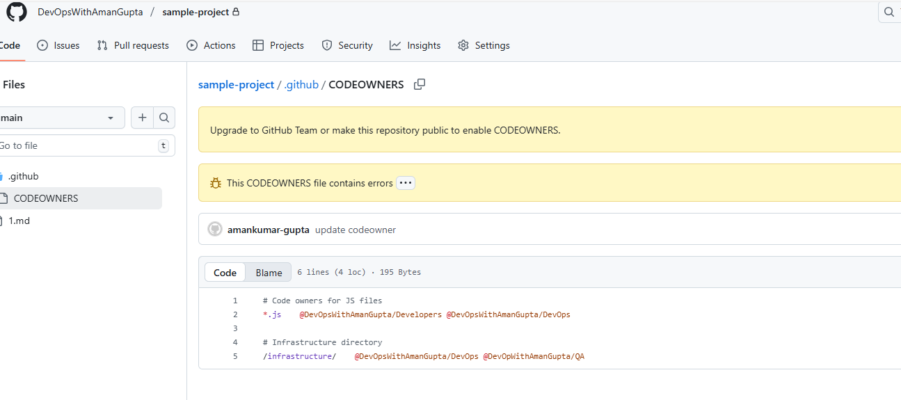

# Season 2 Day 5 Challenge - Solution

## Task 1: Create GitHub Organization and Teams

### Steps:
1. Created a GitHub organization named "DevOpsWithAmanGupta".
2. Set up organization settings.
3. Made three teams: Developers, DevOps, and QA.
4. Invited five users.
5. Added users to their teams.

### Screenshots:

---

## Task 2: Enable Two-Factor Authentication (2FA)

### Steps:
1. Opened Organization Settings → Authentication security.
2. Turned on "Require two-factor authentication for everyone".
3. Set a 7-day grace period for current members.
4. Checked that all members have 2FA enabled.

### Screenshot:

---

## Task 3: Create Repository and Set Team Permissions

### Steps:
1. Made a private repository called "sample-project".
2. Added a README and basic files.
3. Set team permissions:
   - Developers: Write
   - DevOps: Admin
   - QA: Read

### Screenshot:

---

## Task 4: Enable Security Features (Dependabot & Secret Scanning)

### Steps:
1. Went to repository Settings → Security & analysis.
2. Turned on Dependabot alerts and security updates.
3. Enabled secret scanning and push protection for secrets.

### Screenshot:

---

## Task 5: Set Up Branch Protection Rules

### Steps:
1. Opened repository Settings → Branches.
2. Added protection rule for "main" branch.
3. Set:
   - Pull request required before merging
   - 2 approvals needed
   - Code owner review required
   - Status checks must pass
   - Admins included

### Screenshot:

---

## Task 6: Create CODEOWNERS File

### Steps:
1. Made a `.github/CODEOWNERS` file.
2. Added rules:
   - JavaScript: Developer and DevOps approval
   - Infrastructure: DevOps and QA approval
   - Docs: All teams
3. Committed with a clear message.

### Screenshot:

---

## Task 7: Test Direct Commit Restrictions

### Steps:
1. Tried to push directly to main branch.
2. Push was blocked by protection rules.
3. Error message explained why.
---

## Task 8: Set Up Coderabbit Integration

### Steps:
1. Signed up for Coderabbit with GitHub.
2. Installed the Coderabbit GitHub App.
3. Gave access to the sample-project repo.
4. Made an optional `.coderabbit.yaml` config file.
5. Tested with a pull request.
---

## Task 9: Create and Test Pull Request Workflow

### Steps:
1. Made a new feature branch.
2. Added a JavaScript file.
3. Changed infrastructure files.
4. Opened a pull request to main.
5. Checked:
   - 2 approvals needed
   - Code owner reviews required
   - Status checks shown
   - Merge blocked until all done

---

## Task 10: Set Up Snyk Vulnerability Scanning

### Steps:
1. Made a Snyk account with GitHub.
2. Linked sample-project repo.
3. Installed Snyk GitHub App.
4. Ran first vulnerability scan.
5. Made a `.snyk` config file if needed.
---

## Task 11: Configure GitHub Secrets

### Steps:
1. Opened repository Settings → Secrets and variables → Actions.
2. Added secrets:
   - DATABASE_PASSWORD
   - API_KEY
   - SNYK_TOKEN
3. Made a sample script using these environment variables.
4. Tested secret access (without showing values).
---

## Task 12: Set Up Code Review Bot

### Steps:
1. Set up another automated code review tool.
2. Added rules for reviews.
3. Tested the bot with a sample PR.
4. Checked that feedback was useful.
---

## Task 13: Test Complete Security Workflow

### Steps:
1. Made a full test scenario.
2. Made changes needing several code owner approvals.
3. Checked all security checks run.
4. Tested merge restrictions.
5. Confirmed all integrations work together.
---

## Task 14: Review Audit Logs

### Steps:
1. Opened Organization Settings → Audit log.
2. Checked recent security activities.
3. Made sure all changes are logged.
4. Set up monitoring for future events.
---

## Key Findings and Questions

### Finding 1: Branch Protection Effectiveness

**Discovery:** Branch protection rules stop unauthorized changes to main, but can be bypassed if not set up correctly.

**Question:** Why is it important to include administrators in branch protection rules?

**Answer:** Including admins means everyone follows the same rules. It stops admins from accidentally skipping security steps and keeps things consistent.

### Finding 2: Code Owner Review Impact

**Discovery:** The CODEOWNERS file makes sure experts review important changes, improving code quality.

**Question:** How does the CODEOWNERS file improve security beyond just code quality?

**Answer:** CODEOWNERS makes sure security-related files are checked by the right people. This helps catch security issues before they get merged.

### Finding 3: Automated Security Scanning Limitations

**Discovery:** Tools like Dependabot and Snyk find many problems, but can miss some and sometimes give false alarms.

**Question:** Why shouldn't we rely solely on automated security scanning tools?

**Answer:** Automated tools can't catch everything and sometimes make mistakes. Human review is needed to spot issues that tools miss and to check if alerts are real.

### Finding 4: Secret Management Challenges

**Discovery:** GitHub Secrets are safe, but you need to use them correctly in your workflows and scripts.

**Question:** What are the risks of hardcoding secrets in code, even in private repositories?

**Answer:** Hardcoding secrets is risky. They can leak if someone gets repo access, if the repo goes public, or through old commits. Always use secret management tools.

### Finding 5: Two-Factor Authentication Impact

**Discovery:** 2FA makes accounts much safer, but can be tricky if not managed well.

**Question:** Why is organization-wide 2FA enforcement more effective than individual 2FA adoption?

**Answer:** Enforcing 2FA for everyone means no weak links. If one person skips 2FA, it can put the whole organization at risk.

### Finding 6: Integration Complexity

**Discovery:** Using many security tools (Coderabbit, Snyk, Dependabot) covers more ground, but needs good coordination.

**Question:** How can teams balance security automation with development velocity?

**Answer:** Teams should set up tools to give useful feedback, train developers, and adjust settings to avoid too many false alarms. This keeps security strong without slowing down work.

### Finding 7: Audit Trail Importance

**Discovery:** Audit logs show what happened in the organization, but need to be watched to be useful.

**Question:** What security events should trigger immediate investigation in audit logs?

**Answer:** Watch for things like failed logins, permission changes, new or deleted secrets, and changes to security settings. These can signal problems or attacks.

### Finding 8: Supply Chain Security

**Discovery:** Vulnerable dependencies are a big risk and need constant checking and quick fixes.

**Question:** Why is supply chain security becoming increasingly important in modern development?

**Answer:** Many apps use third-party packages. Attackers target these to reach lots of users. Always check your dependencies and update quickly if a problem is found.

### Finding 9: Human Factor in Security

**Discovery:** People are still a big part of security, even with all the tools and rules.

**Question:** How do code review requirements address the human element of security?

**Answer:** Code reviews mean more eyes on changes, so mistakes are less likely. They also help teach good security habits and keep everyone responsible.

### Finding 10: Scalability of Security Measures

**Discovery:** Security steps that work for small teams might need changes as the team gets bigger.

**Question:** What security measures need to be adjusted as development teams scale?

**Answer:** As teams grow, update approval rules, use more detailed permissions, automate more, and make sure everyone knows how to keep things secure.

---

## Lessons Learned

1. **Defense in Depth:** Many layers of security work better than just one.
2. **Automation Balance:** Use automation to help people, not replace them.
3. **User Experience:** Make security easy to use and effective.
4. **Continuous Monitoring:** Always keep an eye on security and update often.
5. **Team Education:** Teach teams how to use security tools and why they matter.

